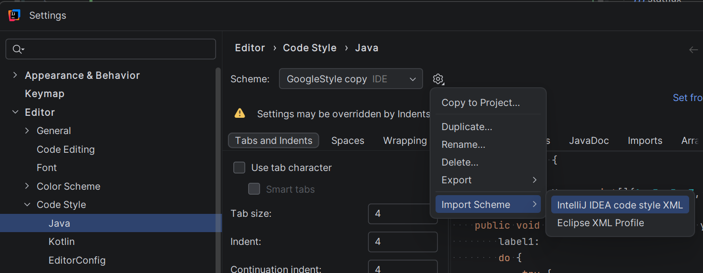

# STATFLUX

Content views service for creators

## Checkstyle

Для поддержания единого стиля кода необходимо импортировать схему в IntellijIDEA:

импортировать файл [intellij-java-google-style.xml](.checkstyle/intellij-java-google-style.xml)

Далее при работе над проектом использовать Ctrl+Alt+L (Reformat Code) для автоматического
форматирования

## Стек

- Java 21
- Maven
- Junit Jupiter

## Архитектура

- bot - слой взаимодействия с Telegram Bot API
- domain - модели и DTO доменной области
    - exceptions - кастомные исключения бизнес-логики
    - dto - DTO
    - result - обёртка, представляющая результат произвольной операции, которая может завершиться
      либо успехом (Success), либо провалом (Failure)
- integration - слой взаимодействия с видеохостингами
    - vk - слой взаимодействия с VK Video
    - youtube - слой взаимодействия с YouTube
- service - слой бизнес логики
    - ServiceLayer - интерфейс, сервис отвечающий за работу с загрузкой и обновлением информации о
      видео
    - UserSessionService - интерфейс, сервис отвечающий за управление пользовательской сессией, мост
      между ServiceLayer и фронтендом
- repository - слой взаимодействия с БД
  - config - фабрика объектов
  - constant - константы слоя
  - datasource - абстракция соединения с БД
  - dto - DTO
  - exception - исключения слоя
  - query - абстракции над исполнением запросов в БД
  - LinkRepository - интерфейс доступа к хранимой сущности Link
- util - вспомогательные классы
- Main.java - точка входа сервиса

## Запуск

### Что нужно заранее

- [Docker Desktop](https://www.docker.com/products/docker-desktop/) установлен и запущен
- Telegram-аккаунт с username
- Аккаунт в [Google Cloud Console](https://console.cloud.google.com/) (для YouTube API ключа)
- Полученный access token от VK Video

### Шаги

**1. Клонировать репозиторий**

```bash
git clone <repo-url>
cd statflux
```

**2. Убедиться, что Docker Desktop работает**

```bash
docker info   # должен выдать список, а не ошибку
```

**3. Освободить порт 5432 (если установлен локальный Postgres)**

```bash
lsof -i :5432   # если что-то есть — останови
brew services stop postgresql       # Homebrew
# или: brew services stop postgresql@16
```

После — повтори `lsof -i :5432`, должно быть пусто.

**4. Получить токен бота**

Токен выдаёт команда разработки. Это строка вида `8123456789:AAEx...` — запиши её как `TELEGRAM_BOT_TOKEN`.

**5. Узнать свой Telegram username**

Telegram → Settings → поле **Username** (без `@`). Например: `jambod`.

**6. Сгенерировать пароль для БД**

```bash
openssl rand -base64 24
# пример: Xk9/vLpQ2mNa4T3eRxCw7sK6/FhDjBgZ
```

**7. Создать `.env`**

```bash
cp .env.example .env
```

Открой `.env` и заполни:

```env
TELEGRAM_BOT_TOKEN=8123456789:AAEx...    # из шага 4
TELEGRAM_BOT_WHITE_LIST=jambod          # из шага 5, без @

POSTGRES_PASSWORD=Xk9/vLpQ2mNa4T3e...  # из шага 6
DB_PASSWORD=Xk9/vLpQ2mNa4T3e...        # то же самое, что POSTGRES_PASSWORD!

YOUTUBE_API_KEY=your_youtube_api_key    # из Google Cloud Console
VK_VIDEO_ACCESS_TOKEN=your_vk_access_token # из VK
```

Остальные значения (`POSTGRES_DB`, `POSTGRES_USER`, `DB_URL`, `DB_USER`) оставь как есть.

**8. Запустить**

```bash
docker compose up --build
```

Первый раз ~2–5 минут: Docker скачивает образы и собирает fat-jar.

Признаки успеха в логах:
- `statflux-db | database system is ready to accept connections`
- `statflux-app | ... BotSession ...` (без Exception)

Оставь этот терминал открытым.

**9. Проверить состояние (новый терминал)**

```bash
docker compose ps               # оба Up, db — healthy
docker compose logs app | tail -30
docker compose logs db  | tail -10
```

**10. Проверить бота**

Найди `@statflux_bot` в Telegram → нажми **/start** → пришли ссылки из поддерживаемых платформ.
Если пишешь с аккаунта не из whitelist — бот молчит, это ожидаемо.

**11. Проверить БД (опционально)**

```bash
docker exec -it statflux-db psql -U statflux -d statflux_db
```

```sql
\du   -- роль statflux есть
\l    -- база statflux_db есть
\q    -- выйти
```

Подключение через DataGrip/DBeaver: хост `localhost`, порт `5432`, база `statflux_db`, пользователь `statflux`.

**12. Остановить**

```bash
docker compose down      # контейнеры стоп, данные БД сохранены
docker compose down -v   # + удалить volume (БД с нуля при следующем запуске)
```

---

### Если что-то пошло не так

| Симптом | Причина | Решение |
|---|---|---|
| `port is already allocated` | Локальный Postgres занял 5432 | Шаг 3 — остановить локальный Postgres |
| `app` перезапускается в цикле | Пустой или неверный `TELEGRAM_BOT_TOKEN` | Проверь `.env`, `docker compose logs app` |
| Бот не отвечает | Username не в whitelist или бот не запущен | Проверь `TELEGRAM_BOT_WHITE_LIST` в `.env` (без `@`) |
| `db` не становится healthy | Volume создан с другим паролем | `docker compose down -v` → повторить шаг 8 |

---

## Основные задачи на хакатоне

Необходимо разработать телеграм-бота и бэкенд-сервис, который обеспечивает следующие функции:

- приём ссылки на видео от пользователя;
- определение платформы и сохранение ссылки в базе данных;
- получение и сохранение количества просмотров видео;
- вывод списка всех добавленных ссылок с актуальными просмотрами;
- подсчёт общего количества ссылок и суммарного количества просмотров;
- обновление статистики (через инлайн-кнопку) с обработкой ошибок и недоступности платформ;
- развёртывание всего решения через Docker.

## Технические требования

- Реализовать телеграм-бота как основной интерфейс.
- Вся бизнес-логика — на Java.
- Использовать базу данных PostgreSQL.
- Обеспечить хранение ссылок, просмотров и агрегированной статистики.
- Развернуть приложение в Docker с подробным README.

## Технологические ограничения

- Основной язык разработки — Java.
- Использование Spring и Spring Boot не допускается.
- Допускается использование Python или Go только для отдельных вспомогательных компонентов (не
  обязательно).
- Система рассчитана на 1–2 пользователей и не требует сложной авторизации.

## Объём для демонстрации

- Обязательная часть: только платформа YouTube (стабильный официальный API).
- Дополнительно (на выбор команды): одна платформа из списка (VK Video, RuTube или Дзен).
- Остальные платформы — как дополнительная функциональность (по желанию).
- Дополнительно (за дополнительные баллы)
- Корректная обработка ситуаций, когда платформа временно недоступна (сохранение последних данных +
  понятный статус).

## Ожидаемый результат

Команда должна предоставить работающий прототип (MVP), который демонстрирует все основные сценарии:

- добавление ссылки,
- получение и обновление просмотров,
- вывод списка и общей статистики.

## Технические артефакты

- Полный репозиторий на GitHub.
- Инструкция по запуску (подробный README).
- Docker-конфигурация.

## Рекомендации для участников

- Для YouTube используйте официальный YouTube Data API v3.
- Для других платформ (если берёте) учитывайте возможную нестабильность парсинга.
- Обеспечьте обработку ошибок и недоступности платформ.
- Подготовьте тестовые ссылки на видео для демонстрации.

## Порядок сдачи работы

Тимлид команды загружает в свой личный кабинет на платформе текстовый документ (или ссылку на Google
Docs с настроенными правами на комментирование или редактирование).
В нём должны быть результаты и ход работы по каждому этапу, а также итоговые артефакты и ссылки на
них, если это необходимо.

## Основные критерии оценивания (60 баллов)

### Критерий 1. Соответствие требованиям кейса

Реализованы все обязательные функции:

- приём ссылки на видео,
- определение платформы,
- сохранение данных,
- получение просмотров,
- вывод списка ссылок,
- подсчёт общей статистики,
- обновление данных

### Критерий 2. Корректность бизнес-логики

- Просмотры корректно сохраняются и обновляются,
- суммарная статистика рассчитывается верно,
- данные соответствуют добавленным ссылкам

### Критерий 3. Глубина технической реализации

Реализованы

- телеграм-бот,
- бэкенд на Java,
- база данных PostgreSQL,
- корректное взаимодействие компонентов,
- обработка запросов стабильна

### Критерий 4. Структура и качество кода

- Код структурирован,
- разделён на слои,
- отсутствует дублирование,
- есть README с инструкцией запуска

### Критерий 5. Практическая применимость решения

- Проект запускается по инструкции,
- телеграм-бот работает,
- основные сценарии выполняются без ошибок

### Критерий 6. Полнота модели данных и сценариев

- Реализовано хранение ссылок,
- просмотров,
- агрегированной статистики,
- поддерживаются все основные сценарии

### Критерий 7. Дополнительная функциональность (дополнительный, +10 баллов, но не более 60 баллов за этап)

- Реализованы дополнительные функции (поддержка второй платформы, обработка ошибок, улучшенный UX
  бота) +10
- Реализованы отдельные улучшения без влияния на основные сценарии +5


