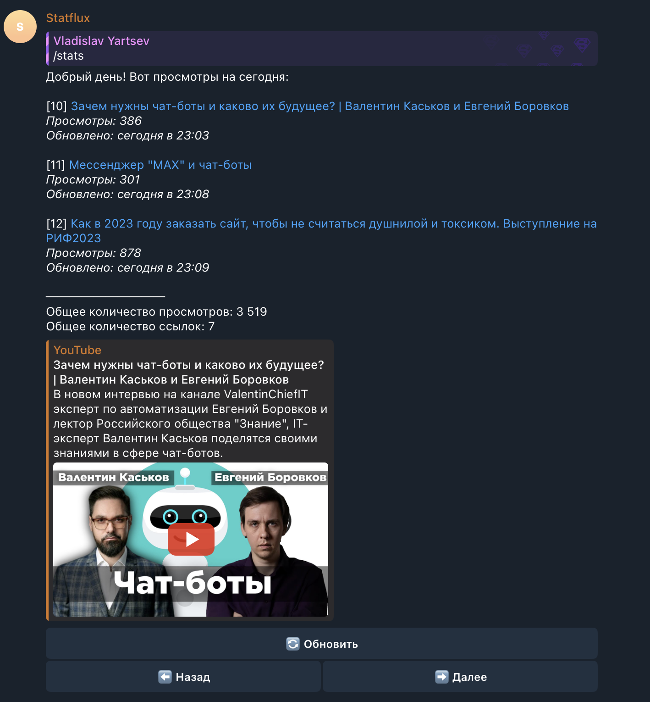
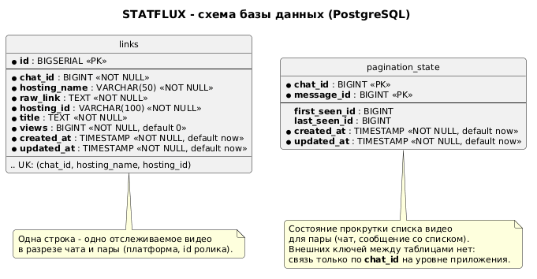
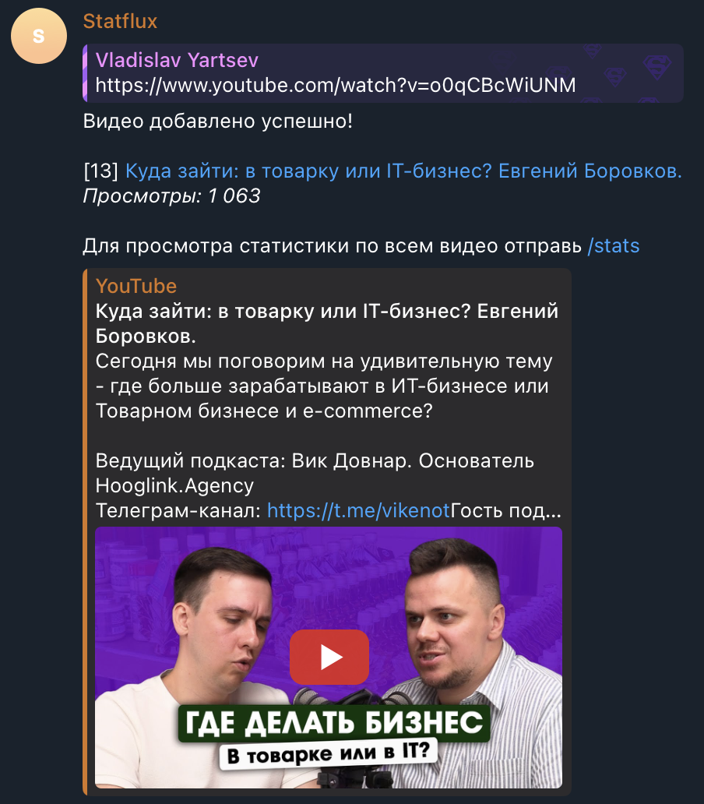
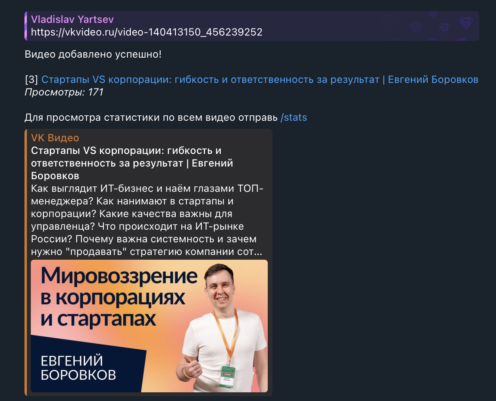
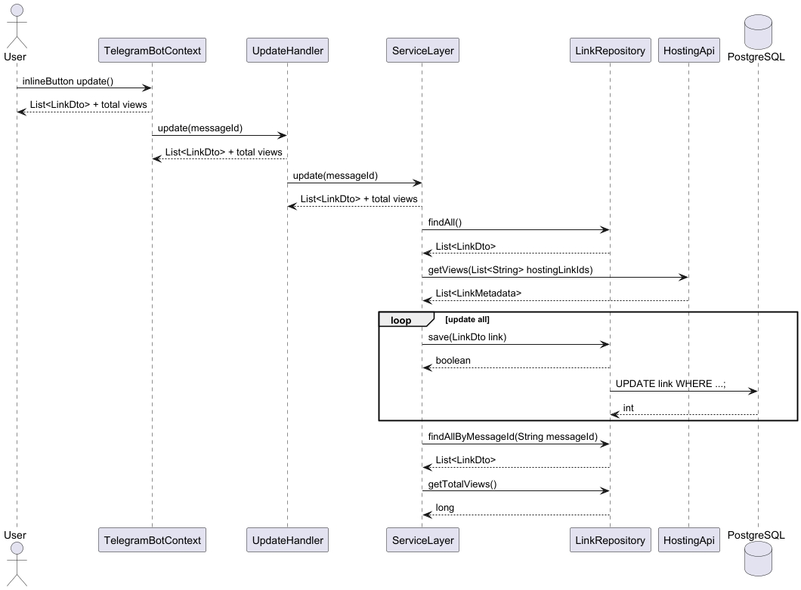
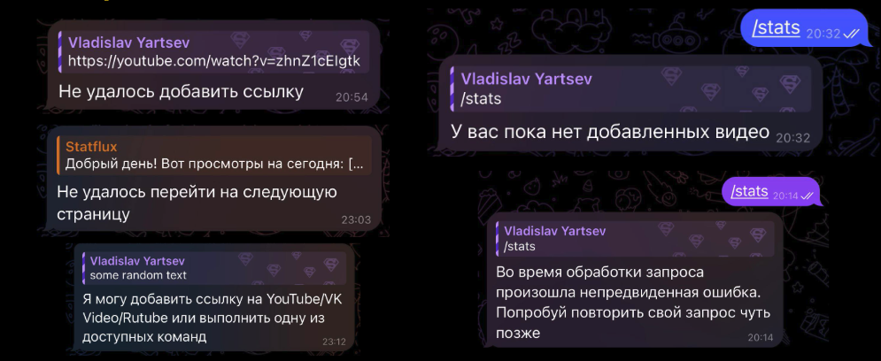
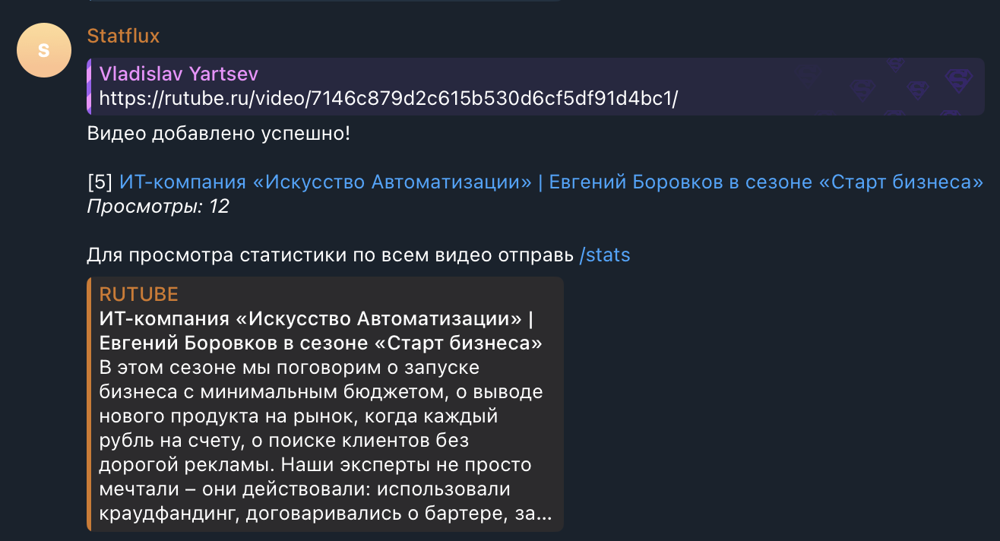

# STATFLUX

Сервис для сбора статистики видео с разных платформ для Botcreators

[Презентация](https://docs.google.com/presentation/d/1fPLdhDomfkoPBrrWCFWXNmNIog5L5wryu7ilzcH79lY/edit?slide=id.g3dbb4f39879_1_199#slide=id.g3dbb4f39879_1_199) - в ней представлена вся функциональность бота

## Состав команды и зоны ответственности

- Ярцев Владислав - тимлид, слой интеграции с Telegram Bot API, локализация
- Федорино Дмитрий - слой работы с данными (DAO)
- Голощапов Алексей - слой бизнес-логики приложения
- Громкова Александра - слой интеграции с YouTube
- Корниенко Антон - слой интеграции с VK Video
- Солонский Михаил - слой интеграции с RuTube, развёртывание (Docker Compose), покрытие тестами

## Стек

- Java 21
- Maven
- Junit Jupiter

## Архитектура

- bot - слой взаимодействия с Telegram Bot API
- domain - модели и DTO доменной области
    - exceptions - кастомные исключения бизнес-логики
    - dto - DTO
    - result - обёртка, представляющая результат произвольной операции, которая может завершиться
      либо успехом (Success), либо провалом (Failure)
- integration - слой взаимодействия с видеохостингами
    - vk - слой взаимодействия с VK Video
    - youtube - слой взаимодействия с YouTube
- service - слой бизнес логики
    - ServiceLayer - интерфейс, сервис отвечающий за работу с загрузкой и обновлением информации о
      видео
    - UserSessionService - интерфейс, сервис отвечающий за управление пользовательской сессией, мост
      между ServiceLayer и фронтендом
- repository - слой взаимодействия с БД
  - config - фабрика объектов
  - constant - константы слоя
  - datasource - абстракция соединения с БД
  - dto - DTO
  - exception - исключения слоя
  - query - абстракции над исполнением запросов в БД
  - LinkRepository - интерфейс доступа к хранимой сущности Link
- util - вспомогательные классы
- Main.java - точка входа сервиса

## Запуск

### Что нужно заранее

- [Docker Desktop](https://www.docker.com/products/docker-desktop/) установлен и запущен
- Telegram-аккаунт с username
- Аккаунт в [Google Cloud Console](https://console.cloud.google.com/) (для YouTube API ключа)
- Полученный access token от VK Video

### Шаги

**1. Клонировать репозиторий**

```bash
git clone <repo-url>
cd statflux
```

**2. Убедиться, что Docker Desktop работает**

```bash
docker info   # должен выдать список, а не ошибку
```

**3. Освободить порт 5432 (если установлен локальный Postgres)**

```bash
lsof -i :5432   # если что-то есть - останови
brew services stop postgresql       # Homebrew
# или: brew services stop postgresql@16
```

После - повтори `lsof -i :5432`, должно быть пусто.

**4. Получить токен бота**

Токен выдаёт команда разработки. Это строка вида `8123456789:AAEx...` - запиши её как `TELEGRAM_BOT_TOKEN`.

**5. Узнать свой Telegram username**

Telegram → Settings → поле **Username** (без `@`). Например: `jambod`.

**6. Сгенерировать пароль для БД**

```bash
openssl rand -base64 24
# пример: Xk9/vLpQ2mNa4T3eRxCw7sK6/FhDjBgZ
```

**7. Создать `.env`**

```bash
cp .env.example .env
```

Открой `.env` и заполни:

```env
TELEGRAM_BOT_TOKEN=8123456789:AAEx...    # из шага 4
TELEGRAM_BOT_WHITE_LIST=jambod          # из шага 5, без @

POSTGRES_PASSWORD=Xk9/vLpQ2mNa4T3e...  # из шага 6
DB_PASSWORD=Xk9/vLpQ2mNa4T3e...        # то же самое, что POSTGRES_PASSWORD!

YOUTUBE_API_KEY=your_youtube_api_key    # из Google Cloud Console
VK_VIDEO_ACCESS_TOKEN=your_vk_access_token # из VK
```

Остальные значения (`POSTGRES_DB`, `POSTGRES_USER`, `DB_URL`, `DB_USER`) оставь как есть.

**8. Запустить**

```bash
docker compose up --build
```

Первый раз ~2-5 минут: Docker скачивает образы и собирает fat-jar.

Признаки успеха в логах:
- `statflux-db | database system is ready to accept connections`
- `statflux-app | ... BotSession ...` (без Exception)

Оставь этот терминал открытым.

**9. Проверить состояние (новый терминал)**

```bash
docker compose ps               # оба Up, db - healthy
docker compose logs app | tail -30
docker compose logs db  | tail -10
```

**10. Проверить бота**

Найди `@statflux_bot` в Telegram → нажми **/start** → пришли ссылки из поддерживаемых платформ.
Чтобы убрать видео из своего списка, отправь команду `/delete` и числовой id строки из сообщения со статистикой в этом чате (например `/delete 3`). Подсказка есть в ответе бота при вызове `/delete` без аргумента.
Если пишешь с аккаунта не из whitelist - бот молчит, это ожидаемо.

Пример: список видео, суммарная статистика и кнопки навигации и обновления.



**11. Проверить БД (опционально)**

```bash
docker exec -it statflux-db psql -U statflux -d statflux_db
```

```sql
\du   -- роль statflux есть
\l    -- база statflux_db есть
\q    -- выйти
```

Подключение через DataGrip/DBeaver: хост `localhost`, порт `5432`, база `statflux_db`, пользователь `statflux`.

**12. Остановить**

```bash
docker compose down      # контейнеры стоп, данные БД сохранены
docker compose down -v   # + удалить volume (БД с нуля при следующем запуске)
```

---

### Если что-то пошло не так

| Симптом | Причина | Решение |
|---|---|---|
| `port is already allocated` | Локальный Postgres занял 5432 | Шаг 3 - остановить локальный Postgres |
| `app` перезапускается в цикле | Пустой или неверный `TELEGRAM_BOT_TOKEN` | Проверь `.env`, `docker compose logs app` |
| Бот не отвечает | Username не в whitelist или бот не запущен | Проверь `TELEGRAM_BOT_WHITE_LIST` в `.env` (без `@`) |
| `db` не становится healthy | Volume создан с другим паролем | `docker compose down -v` → повторить шаг 8 |

---

## Основные задачи на хакатоне

Необходимо разработать телеграм-бота и бэкенд-сервис, который обеспечивает следующие функции:

- приём ссылки на видео от пользователя.
- определение платформы и сохранение ссылки в базе данных.
- получение и сохранение количества просмотров видео.
- вывод списка всех добавленных ссылок с актуальными просмотрами.
- подсчёт общего количества ссылок и суммарного количества просмотров.
- обновление статистики (через инлайн-кнопку) с обработкой ошибок и недоступности платформ.
- развёртывание всего решения через Docker.

## Технические требования

- Реализовать телеграм-бота как основной интерфейс.
- Вся бизнес-логика - на Java.
- Использовать базу данных PostgreSQL.
- Обеспечить хранение ссылок, просмотров и агрегированной статистики.
- Развернуть приложение в Docker с подробным README.

## Технологические ограничения

- Основной язык разработки - Java.
- Использование Spring и Spring Boot не допускается.
- Допускается использование Python или Go только для отдельных вспомогательных компонентов (не
  обязательно).
- Система рассчитана на 1-2 пользователей и не требует сложной авторизации.

## Объём для демонстрации

- Обязательная часть: только платформа YouTube (стабильный официальный API).
- Дополнительно (на выбор команды): одна платформа из списка (VK Video, RuTube или Дзен).
- Остальные платформы - как дополнительная функциональность (по желанию).
- Дополнительно (за дополнительные баллы)
- Корректная обработка ситуаций, когда платформа временно недоступна (сохранение последних данных +
  понятный статус).

## Ожидаемый результат

Команда должна предоставить работающий прототип (MVP), который демонстрирует все основные сценарии:

- добавление ссылки,
- получение и обновление просмотров,
- вывод списка и общей статистики.

## Технические артефакты

- Полный репозиторий на GitHub.
- Инструкция по запуску (подробный README).
- Docker-конфигурация.
- Скриншоты работы бота и схемы (БД, обновление статистики, ошибки) встроены в этот файл ниже: в разделе «Отчёт о ходе работы и итоговые артефакты» по соответствующим этапам и в разделе «Запуск» после проверки бота.

## Отчёт о ходе работы и итоговые артефакты

Ниже кратко по этапам, с опорой на [историю `main` на GitHub](https://github.com/dfedorino/statflux/commits/main). У каждого этапа указаны реальные артефакты: коммиты (ссылка вида `https://github.com/dfedorino/statflux/commit/<hash>`), pull request и пути к коду или конфигам в репозитории.

### Этап 1. Старт проекта и архитектура (15-16 апреля 2026)

**Ход работы.** Создан каркас Java-проекта на Maven, точка входа и заготовки слоёв без Spring. В [PR #28](https://github.com/dfedorino/statflux/pull/28) описана модульная структура, добавлены интерфейсы интеграции с хостингами, контракт репозитория и сервиса, заготовки под VK и YouTube, подключены CI и Checkstyle.

**Результат.** Зафиксированы границы слоёв (bot, domain, integration, service, repository). Типобезопасный ADT `Result` и фабрика провайдеров появляются на следующем этапе в PR #33.

**Артефакты.**

- Коммиты на GitHub: [`47b79d8`](https://github.com/dfedorino/statflux/commit/47b79d8) (Initial commit), [`518d57f`](https://github.com/dfedorino/statflux/commit/518d57f) (обновление README), [`6d82b4a`](https://github.com/dfedorino/statflux/commit/6d82b4a) (сливание PR #28).
- Код и конфигурация: [`pom.xml`](pom.xml), [`Dockerfile`](Dockerfile), [`src/main/java/com/rmrf/statflux/Main.java`](src/main/java/com/rmrf/statflux/Main.java), workflow [`.github/workflows/ci.yml`](.github/workflows/ci.yml), правила [`.checkstyle/google_checks.xml`](.checkstyle/google_checks.xml). В коммите `6d82b4a` добавлена диаграмма `architecture.puml` (позже в PR #34 разбита на сценарные [`src/main/resources/add.puml`](src/main/resources/add.puml), [`update.puml`](src/main/resources/update.puml), [`stats.puml`](src/main/resources/stats.puml)).

### Этап 2. Домен и сервисный слой (17-19 апреля 2026)

**Ход работы.** Реализованы доменные DTO и исключения, ADT `Result`, фабрика интеграций и полноценный [`ServiceLayerImpl`](src/main/java/com/rmrf/statflux/service/ServiceLayerImpl.java): добавление ссылки, выборка списка, обновление статистики (`refreshVideos`), контракты с метаданными и пагинацией ответа (`hasNext`). Добавлены тесты фабрики и заготовки сессии пользователя.

**Результат.** Закрыт [PR #33](https://github.com/dfedorino/statflux/pull/33). Ядро бизнес-логики отделено от Telegram и конкретных HTTP API платформ.

**Артефакты.**

- Коммит на GitHub: [`effb962`](https://github.com/dfedorino/statflux/commit/effb962) (сливание PR #33).
- Код: пакет [`src/main/java/com/rmrf/statflux/domain/`](src/main/java/com/rmrf/statflux/domain/) (в том числе [`domain/result/`](src/main/java/com/rmrf/statflux/domain/result/), DTO, исключения), [`ServiceLayerImpl.java`](src/main/java/com/rmrf/statflux/service/ServiceLayerImpl.java), [`ServiceLayer.java`](src/main/java/com/rmrf/statflux/service/ServiceLayer.java), интеграционный контракт и фабрика в коммите (в текущем `main` развиты как [`VideoProvider.java`](src/main/java/com/rmrf/statflux/integration/VideoProvider.java), [`VideoProviderFactory.java`](src/main/java/com/rmrf/statflux/integration/VideoProviderFactory.java)), тесты [`VideoProviderFactoryTest.java`](src/test/java/com/rmrf/statflux/integration/VideoProviderFactoryTest.java).

### Этап 3. Слой данных и архитектура бота (18-19 апреля 2026)

**Ход работы.** Введён JDBC-слой и схема PostgreSQL ([PR #34](https://github.com/dfedorino/statflux/pull/34)). Собран каркас телеграм-бота на цепочке обработчиков и whitelist ([PR #36](https://github.com/dfedorino/statflux/pull/36)). Добавлена пагинация на стороне БД ([PR #46](https://github.com/dfedorino/statflux/pull/46)). Интерфейс [`LinkRepository`](src/main/java/com/rmrf/statflux/repository/LinkRepository.java) и реализация [`JdbcLinkRepository`](src/main/java/com/rmrf/statflux/repository/JdbcLinkRepository.java) связывают сервис с таблицами. Пользовательская сессия в коде эволюционирует к объединению с сервисным слоём на этапе 4.

**Результат.** Ссылки и состояние списка сохраняются в БД. Бот подключается к приложению как отдельный слой.

**Артефакты.**

- Коммиты на GitHub: [`f3b6156`](https://github.com/dfedorino/statflux/commit/f3b6156), merge [`6129a0a`](https://github.com/dfedorino/statflux/commit/6129a0a) (PR #36), [`90a9397`](https://github.com/dfedorino/statflux/commit/90a9397) (PR #34), [`532635a`](https://github.com/dfedorino/statflux/commit/532635a) (PR #46).
- Код и схема: [`src/main/java/com/rmrf/statflux/repository/`](src/main/java/com/rmrf/statflux/repository/), [`src/main/resources/schema.sql`](src/main/resources/schema.sql), интеграционные тесты [`LinkRepositoryIT.java`](src/test/java/com/rmrf/statflux/repository/LinkRepositoryIT.java), бот [`src/main/java/com/rmrf/statflux/bot/`](src/main/java/com/rmrf/statflux/bot/), источник диаграммы [`puml/statflux-database.puml`](puml/statflux-database.puml).
- Визуальная схема модели данных PostgreSQL (результат проектирования под задачу хранения ссылок и состояния пагинации):



### Этап 4. Интеграции YouTube и VK, команды и транзакции (19-21 апреля 2026)

**Ход работы.** Подключены YouTube Data API ([PR #47](https://github.com/dfedorino/statflux/pull/47)) и VK Video ([PR #52](https://github.com/dfedorino/statflux/pull/52)), конфигурация секретов через `.env` доработана в том числе для Docker ([PR #57](https://github.com/dfedorino/statflux/pull/57)). Добавлены обработчики команд ([`3a55ddb`](https://github.com/dfedorino/statflux/commit/3a55ddb)) и сценарии списка и обновления ([PR #54](https://github.com/dfedorino/statflux/pull/54)). Введены транзакции и пул соединений ([PR #51](https://github.com/dfedorino/statflux/pull/51)). Исправление параметров сервиса ([PR #50](https://github.com/dfedorino/statflux/pull/50), коммит [`19a5bd4`](https://github.com/dfedorino/statflux/commit/19a5bd4)).

**Результат.** Обязательная платформа (YouTube) и дополнительная (VK) работают через единый провайдерный слой. Ключи задаются через [`IntegrationConfigFromEnv.java`](src/main/java/com/rmrf/statflux/integration/config/IntegrationConfigFromEnv.java).

**Артефакты.**

- Коммиты на GitHub: [`29d7416`](https://github.com/dfedorino/statflux/commit/29d7416) (PR #47), [`3a55ddb`](https://github.com/dfedorino/statflux/commit/3a55ddb), [`67eb58c`](https://github.com/dfedorino/statflux/commit/67eb58c) (merge PR #45), [`d314f4f`](https://github.com/dfedorino/statflux/commit/d314f4f) (PR #51), [`b7b974e`](https://github.com/dfedorino/statflux/commit/b7b974e) (PR #54), [`5bf0e7d`](https://github.com/dfedorino/statflux/commit/5bf0e7d) (PR #52), [`036caaa`](https://github.com/dfedorino/statflux/commit/036caaa) (PR #57), [`19a5bd4`](https://github.com/dfedorino/statflux/commit/19a5bd4) (PR #50).
- Код: [`integration/youtube/`](src/main/java/com/rmrf/statflux/integration/youtube/), [`integration/vk/`](src/main/java/com/rmrf/statflux/integration/vk/), [`integration/config/`](src/main/java/com/rmrf/statflux/integration/config/), пул и транзакции в [`repository/datasource/impl/PooledDataSource.java`](src/main/java/com/rmrf/statflux/repository/datasource/impl/PooledDataSource.java), [`repository/transaction/`](src/main/java/com/rmrf/statflux/repository/transaction/), [`docker-compose.yml`](docker-compose.yml).
- Скриншоты успешного добавления ссылки (YouTube и VK Video):





### Этап 5. Docker, секреты и проектная документация (19-20 апреля 2026)

**Ход работы.** В README добавлены инструкции по окружению, Docker и секретам. Ветка сливается в [PR #49](https://github.com/dfedorino/statflux/pull/49). Отдельно добавлены пример презентации Marp и [`docs/README.md`](docs/README.md) про сборку PPTX и экспорт PlantUML.

**Результат.** Запуск воспроизводим по документу в корне репозитория. Материалы для защиты можно собрать из `docs/`.

**Артефакты.**

- Коммиты на GitHub: [`deed9f1`](https://github.com/dfedorino/statflux/commit/deed9f1), [`f4659e0`](https://github.com/dfedorino/statflux/commit/f4659e0), merge [`b84903c`](https://github.com/dfedorino/statflux/commit/b84903c) (PR #49).
- Файлы: раздел [Запуск](#запуск) в этом README, [`docker-compose.yml`](docker-compose.yml), [`.env.example`](.env.example), [`docs/presentation-example.md`](docs/presentation-example.md), [`docs/presentation-example.pptx`](docs/presentation-example.pptx), [`docs/README.md`](docs/README.md).

### Этап 6. Связка с моками, пакетный VK, парсинг ссылок (21-23 апреля 2026)

**Ход работы.** Сервисный слой подключён к заглушкам и сценарию «статистика на моках» ([PR #59](https://github.com/dfedorino/statflux/pull/59), [PR #61](https://github.com/dfedorino/statflux/pull/61)). Для VK добавлена асинхронная пакетная загрузка метаданных при большом числе видео ([PR #62](https://github.com/dfedorino/statflux/pull/62)) и парсер URL ([PR #63](https://github.com/dfedorino/statflux/pull/63)).

**Результат.** Меньше проблем с лимитами VK и разными форматами ссылок.

**Артефакты.**

- Коммиты на GitHub: merge [`6a97bdb`](https://github.com/dfedorino/statflux/commit/6a97bdb) (PR #59), [`716546e`](https://github.com/dfedorino/statflux/commit/716546e), merge [`17ca76c`](https://github.com/dfedorino/statflux/commit/17ca76c) (PR #61), [`3954cc8`](https://github.com/dfedorino/statflux/commit/3954cc8) (PR #62), [`d1957a5`](https://github.com/dfedorino/statflux/commit/d1957a5) (PR #63).
- Код: [`integration/vk/parser/VkUrlParser.java`](src/main/java/com/rmrf/statflux/integration/vk/parser/VkUrlParser.java), доработки [`VkVideoProviderImpl.java`](src/main/java/com/rmrf/statflux/integration/vk/VkVideoProviderImpl.java) и связанных парсеров.

### Этап 7. Пакетное обновление статистики, RuTube, надёжность и тесты (24-25 апреля 2026)

**Ход работы.** Пакетное обновление в `refreshVideos` и обработка ошибок платформ ([PR #64](https://github.com/dfedorino/statflux/pull/64), [PR #65](https://github.com/dfedorino/statflux/pull/65)). Интеграционные тесты с Testcontainers ([PR #68](https://github.com/dfedorino/statflux/pull/68)). Исправление рассинхрона пагинации после обновления ([PR #70](https://github.com/dfedorino/statflux/pull/70), коммиты [`4b1f829`](https://github.com/dfedorino/statflux/commit/4b1f829), [`84c2cfc`](https://github.com/dfedorino/statflux/commit/84c2cfc)). Зачатки RuTube уходят в этап 8 PR #71.

**Результат.** Меньше обращений к внешним API при массовом обновлении. Регрессии ловятся IT с PostgreSQL в контейнере.

**Артефакты.**

- Коммиты на GitHub: [`fe19741`](https://github.com/dfedorino/statflux/commit/fe19741) (PR #64), [`2499a89`](https://github.com/dfedorino/statflux/commit/2499a89) (PR #65), [`931b616`](https://github.com/dfedorino/statflux/commit/931b616) (PR #68), [`4b1f829`](https://github.com/dfedorino/statflux/commit/4b1f829), [`84c2cfc`](https://github.com/dfedorino/statflux/commit/84c2cfc), merge [`5870fbe`](https://github.com/dfedorino/statflux/commit/5870fbe) (PR #70).
- Код и тесты: [`ServiceLayerImpl.java`](src/main/java/com/rmrf/statflux/service/ServiceLayerImpl.java), IT [`FullFlowIT.java`](src/test/java/com/rmrf/statflux/repository/FullFlowIT.java), [`LinkRepositoryIT.java`](src/test/java/com/rmrf/statflux/repository/LinkRepositoryIT.java), [`PaginationStateRepositoryIT.java`](src/test/java/com/rmrf/statflux/repository/PaginationStateRepositoryIT.java), [`ConnectionPoolIT.java`](src/test/java/com/rmrf/statflux/repository/ConnectionPoolIT.java), зависимость Testcontainers в [`pom.xml`](pom.xml).
- Схема сценария обновления статистики и сообщение пользователю при ошибках платформы:





### Этап 8. UX телеграм-бота, RuTube, извлечение URL (25 апреля - 2 мая 2026)

**Ход работы.** Экранирование MarkdownV2 ([PR #72](https://github.com/dfedorino/statflux/pull/72)), формат чисел ([PR #77](https://github.com/dfedorino/statflux/pull/77)), привязка ссылок к `chat_id` ([PR #74](https://github.com/dfedorino/statflux/pull/74)), интеграция RuTube ([PR #71](https://github.com/dfedorino/statflux/pull/71)), извлечение первого URL из текста ([PR #79](https://github.com/dfedorino/statflux/pull/79)), удаление ссылки из списка ([PR #82](https://github.com/dfedorino/statflux/pull/82)).

**Результат.** Сообщения в Telegram отображаются корректно. Поддерживаются несколько платформ и удобный ввод ссылок. Запись о видео можно убрать из своего списка командой `/delete` и числовым id строки из выдачи статистики в этом чате.

**Артефакты.**

- Коммиты на GitHub: [`43d14e8`](https://github.com/dfedorino/statflux/commit/43d14e8), merge [`62ec060`](https://github.com/dfedorino/statflux/commit/62ec060) (PR #74), [`649403a`](https://github.com/dfedorino/statflux/commit/649403a), merge [`118df62`](https://github.com/dfedorino/statflux/commit/118df62) (PR #72), merge [`89a52b7`](https://github.com/dfedorino/statflux/commit/89a52b7) (PR #77), [`cfc3ff5`](https://github.com/dfedorino/statflux/commit/cfc3ff5) (PR #71), [`b849cfb`](https://github.com/dfedorino/statflux/commit/b849cfb) (PR #79), [`962aa77`](https://github.com/dfedorino/statflux/commit/962aa77) (PR #82).
- Код: [`integration/rutube/`](src/main/java/com/rmrf/statflux/integration/rutube/), [`bot/infra/util/MessageUrlsExtractor.java`](src/main/java/com/rmrf/statflux/bot/infra/util/MessageUrlsExtractor.java), правки обработчиков и форматирования в [`src/main/java/com/rmrf/statflux/bot/`](src/main/java/com/rmrf/statflux/bot/). Удаление из списка: [`CommandDeleteHandler.java`](src/main/java/com/rmrf/statflux/bot/infra/handler/CommandDeleteHandler.java), метод [`ServiceLayer.deleteVideo`](src/main/java/com/rmrf/statflux/service/ServiceLayer.java), реализация в [`ServiceLayerImpl`](src/main/java/com/rmrf/statflux/service/ServiceLayerImpl.java), удаление строки в БД в [`JdbcLinkRepository`](src/main/java/com/rmrf/statflux/repository/JdbcLinkRepository.java), тексты в [`src/main/resources/l10n/ru.yaml`](src/main/resources/l10n/ru.yaml) (раздел `delete`).
- Скриншот успешного добавления RuTube:



### Этап 9. Тестирование и стабилизация (май 2026)

**Ход работы.** В истории Git есть коммит [`e802d98`](https://github.com/dfedorino/statflux/commit/e802d98) с расширением unit-тестов middleware бота, правками интеграционных тестов репозитория и настройками `pom.xml` и `docker-compose.yml`. На момент последней синхронизации `main` этот коммит может быть только на отдельной ветке. Полный список веток и предков смотрите через `git log --all` или интерфейс GitHub.

**Результат.** После слияния соответствующей ветки усиливается регрессионное покрытие middleware и репозитория.

**Артефакты.**

- Коммит на GitHub (если доступен в вашем форке или после merge): [`e802d98`](https://github.com/dfedorino/statflux/commit/e802d98).
- Ожидаемые файлы по сообщению коммита: тесты в [`src/test/java/com/rmrf/statflux/bot/infra/middleware/`](src/test/java/com/rmrf/statflux/bot/infra/middleware/), правки IT в [`src/test/java/com/rmrf/statflux/repository/`](src/test/java/com/rmrf/statflux/repository/).

## Рекомендации для участников

- Для YouTube используйте официальный YouTube Data API v3.
- Для других платформ (если берёте) учитывайте возможную нестабильность парсинга.
- Обеспечьте обработку ошибок и недоступности платформ.
- Подготовьте тестовые ссылки на видео для демонстрации.

## Основные критерии оценивания (60 баллов)

### Критерий 1. Соответствие требованиям кейса

Реализованы все обязательные функции:

- Приём ссылки на видео.
- Определение платформы.
- Сохранение данных.
- Получение просмотров.
- Вывод списка ссылок.
- Подсчёт общей статистики.
- Обновление данных.

### Критерий 2. Корректность бизнес-логики

- Просмотры корректно сохраняются и обновляются.
- Суммарная статистика рассчитывается верно.
- Данные соответствуют добавленным ссылкам.

### Критерий 3. Глубина технической реализации

Реализованы:

- Телеграм-бот.
- Бэкенд на Java.
- База данных PostgreSQL.
- Корректное взаимодействие компонентов.
- Обработка запросов стабильна.

### Критерий 4. Структура и качество кода

- Код структурирован.
- Код разделён на слои.
- Отсутствует дублирование.
- Есть README с инструкцией запуска.

### Критерий 5. Практическая применимость решения

- Проект запускается по инструкции.
- Телеграм-бот работает.
- Основные сценарии выполняются без ошибок.

### Критерий 6. Полнота модели данных и сценариев

- Реализовано хранение ссылок.
- Реализовано хранение просмотров.
- Реализована агрегированная статистика.
- Поддерживаются все основные сценарии.

### Критерий 7. Дополнительная функциональность (дополнительный, +10 баллов, но не более 60 баллов за этап)

- Реализованы дополнительные функции (поддержка второй платформы, обработка ошибок, улучшенный UX бота): +10.
- Реализованы отдельные улучшения без влияния на основные сценарии: +5.
- Реализовано удаление видео.

