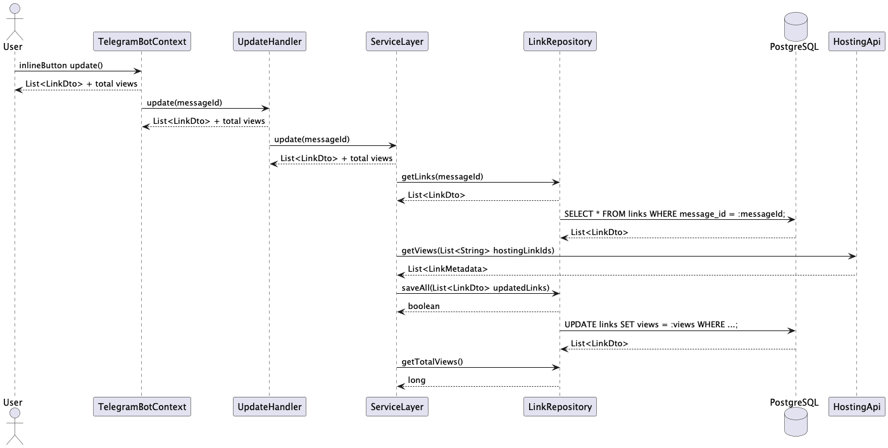

<!-- СЛАЙД 1 -->
<!-- _class: lead -->
<!-- _paginate: false -->

# statflux

## Агрегатор статистики видео

**Java 21 · PostgreSQL · Telegram Bot**

Команда **rmrf** · МИФИ · Апрель 2026

---

<!-- СЛАЙД 2 – Зачем и для кого -->

## Зачем нужен этот бот

<style scoped>
table { font-size: 15px !important; }
table th, table td { padding: 9px 10px !important; }
</style>

| Аудитория | Боль | Что даёт statflux |
|---|---|---|
| **Владелец YouTube/VK Video-канала** | Несколько вкладок, ручное копирование цифр | Одна команда `/stats` – сводка по всем платформам |
| **Контент-менеджер** | Ручной мониторинг раз в день, легко пропустить спад | Авто-обновление каждые 15 мин, Telegram всегда под рукой |
| **Небольшая студия (1–5 чел.)** | Нет бюджета на BI-системы вроде Tableau или Power BI | Бесплатно, разворачивается за `docker compose up` |
| **Блогер / преподаватель** | Платформы дают разные единицы – сложно суммировать | `/list` – единый список с суммой просмотров |

---

<!-- СЛАЙД 3 – UI: как это выглядит -->

## Интерфейс бота

<div class="columns">
<div>

> Пользователь отправляет ссылку:
> `https://youtu.be/dQw4w9WgXcQ`

> Бот отвечает:
> [YouTube] Rick Astley – Never Gonna Give You Up
> 1 547 823 просмотров – добавлено

</div>
<div>

> `/list` – полный список:
>
> Ваши видео (3):
>
> 1. [YouTube] Rick Astley – Never...
>    1 547 823 · 2 мин назад · OK
>
> 2. [RuTube] Хакатон МИФИ 2026
>    8 902 · сейчас · OK
>
> 3. [YouTube] Старый ролик
>    5 000 (последние данные) · UNAVAILABLE
>
> [Обновить]   [<]   [>]

</div>
</div>

---

<!-- СЛАЙД 4 – Диаграмма: обновление статистики -->

## Сценарий: обновление статистики (кнопка / `/refresh`)


---

<!-- СЛАЙД 5 – Код: Chain of Responsibility -->

## Архитектура бота – Chain of Responsibility

```java
// Chain.java – Generic цепочка обработчиков
public class Chain<T> implements Consumer<T> {

    public interface Node<T> {
        void handle(T ctx, Consumer<T> next);
    }

    @Override
    public void accept(T ctx) {
        run(ctx, 0);
    }

    private void run(T ctx, int index) {
        if (index >= nodes.size()) {
            return;
        }

        nodes.get(index).handle(ctx, next -> {
            run(next, index + 1);
        });
    }
}
```

```java
// Main.java – ручная сборка, без Spring
TelegramBotRootConsumer bot = TelegramBotRootConsumer.builder()
    .withClient(new OkHttpTelegramClient(botConfig.getToken()))
    .use(new WhiteListMiddleware(botConfig.getWhiteList()))
    .use(new EchoHandler())
    .build();
```

> Добавить команду = `implements Chain.Node<TelegramBotContext>` + `.use(new MyHandler())`.

---

<!-- СЛАЙД 6 – Код: Repository / upsert -->

## Слой данных – upsert без ORM

```java
// JdbcLinkRepository.java
@Override
public boolean save(@NonNull LinkDto linkDto) {
    // сначала UPDATE – идемпотентность, дубли исключены
    int updated = queryExecutor.update(
        LinkSql.UPDATE,
        linkDto.rawLink(), linkDto.title(), linkDto.views(),
        linkDto.updatedAt(), linkDto.hostingName(), linkDto.hostingId()
    );

    // если строки не было – INSERT
    return updated == 1 || queryExecutor.update(
        LinkSql.INSERT,
        linkDto.hostingName(), linkDto.rawLink(), linkDto.hostingId(),
        linkDto.title(), linkDto.views(), linkDto.updatedAt()
    ) > 0;
}

@Override
public long getTotalViewSum() {
    return queryExecutor
        .query(LinkSql.GET_TOTAL_VIEW_SUM, rs -> rs.getLong(1))
        .getFirst();
}
```

Чистый JDBC + `QueryExecutor` поверх `PreparedStatement`. Никакого ORM.
